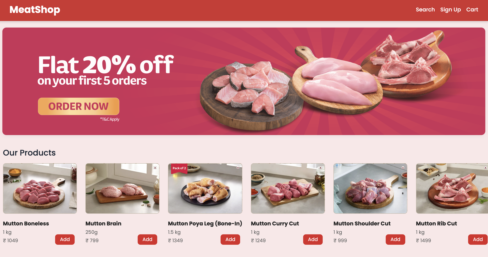
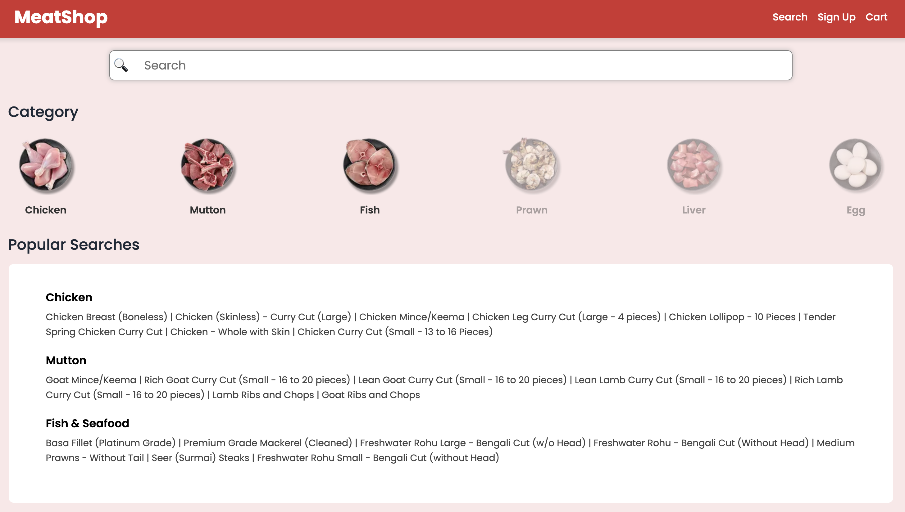
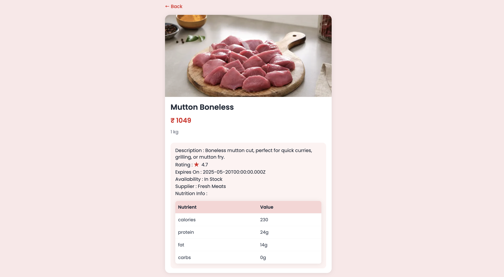

#  MERN Stack Meatshop Online Application

A full-stack e-commerce web application built using the MERN stack that allows users to browse meat products, manage shopping carts, and securely place orders.

This project demonstrates modern full-stack web development practices including secure authentication, RESTful API architecture, and scalable backend design.

---

#  Project Overview

The Meatshop application provides an online platform where customers can browse different meat products and place orders easily.

The system includes:

• Product browsing and filtering
• Secure user authentication
• Shopping cart functionality
• REST API for product and order management

The goal of this project is to simulate a **real-world e-commerce system using MERN stack technologies**.

---

#  System Architecture

Frontend

• Built using React.js
• Responsive UI with modern component architecture
• Product listing and category filtering
• Persistent shopping cart using Local Storage

Backend

• Node.js and Express.js REST API
• JWT authentication system
• Secure password hashing
• Order and product management APIs

Database

• MongoDB database for storing products, users, and orders

---

#  Tech Stack

Frontend

• React.js
• JavaScript (ES6+)
• HTML5
• CSS3

Backend

• Node.js
• Express.js

Database

• MongoDB

Authentication

• JSON Web Token (JWT)
• Password hashing

Tools

• Git
• GitHub
• Postman
• VS Code

---

#  Key Features

User Authentication

Secure login and registration using JWT authentication.

Product Catalog

Users can browse available meat products with filtering options.

Shopping Cart

Users can add items to cart with persistent storage using Local Storage.

RESTful API

Backend services handle product, user, and order operations.

Responsive UI

Application works across desktop and mobile devices.

---

# API Example

Get all products

GET /api/products

Example response

{
"name": "Chicken Breast",
"price": 250,
"category": "Chicken",
"stock": 20
}

---

#  Screenshots

Home Page

Login Page

Search Page

 Discription Product

Categories Page

---

#  Installation & Setup

Clone repository

git clone https://github.com/senthilnathan-2004/meatshop.git

Move to project directory

cd meatshop

Install dependencies

npm install

Run backend server

node server.js

Run frontend

npm start

Open browser

http://localhost:3000

---

#  Future Improvements

• Online payment gateway integration
• Order tracking system
• Admin dashboard
• Product image upload system
• Inventory management system

---

#  Author

Senthilnathan R

GitHub
https://github.com/senthilnathan-2004

LinkedIn
https://linkedin.com/in/senthilnathan--r

Portfolio
https://senthilnathan-2004.github.io/sen_pro

